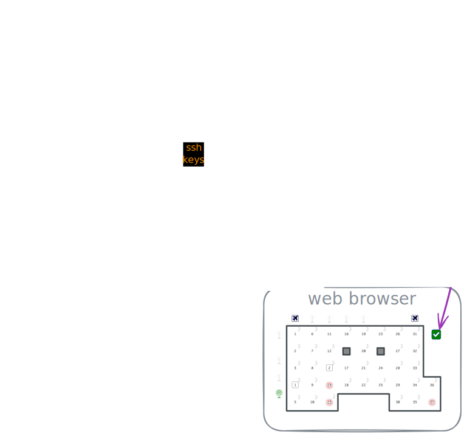

# R2lab sidecar

`r2lab-sidecar` is websockets companion to the R2lab testbed.  
It runs on address `r2lab-sidecar.inria.fr` on port `443`.  
It holds the overall testbed status + current leases, and is in charge of
broadcasting it to the connected clients - including the R2lab web interface.

see the `doc/` folder for more information

