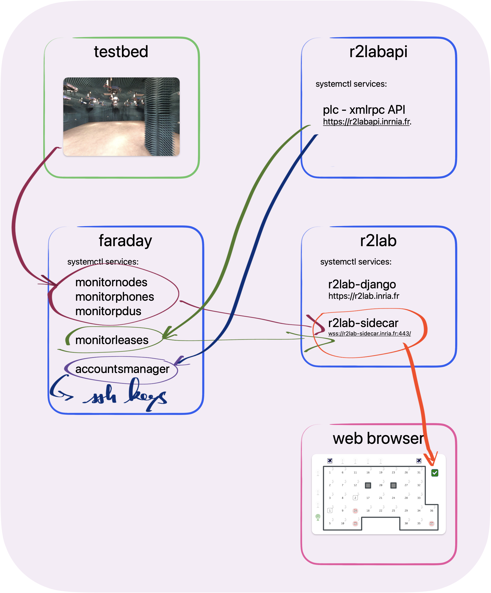

# The R2lab infra architecture



## updates

* every piece of code that might be of interest to either the infra (or the nodes, btw) is kept in a git repository `r2lab-embedded`
* this contains `services/pull-and-restart.sh` and related systemd files (service, timer), which takes care of updating the code on a regular basis

## faraday

runs several services

* in order to retrieve state from the hardware, through dedicated code:
  * service `monitornodes`
  * service `monitorphones`
  * service `monitorpdus`
  * then each of these 3 services pushes its data to the sidecar server
* refreshing the leases, by asking the PLCAPI over xmlrpc
  * service `monitorleases`
  * this also pushes its data to the sidecar server
* syncing the current user accounts from the PLCAPI
  * service `accountsmanager`
  * this does side effects on `/etc/passwd` and related system files, as well as on users `authorized_keys` files

all this is part of `rhubarbe` which is `pip install`'ed

## r2lab

runs primarily the folloiwng services

* `nginx` that does the SSL / https termination (and hands over to sjango using `gunicorn`)
* `r2lab-django` that serves the web interface
* `r2lab-sidecar` that runs the websockets server

as of end of 2024, this comes from

* `pip install r2lab-sidecar`
* and the website is cloned in `/root/r2lab.inria.fr` and `/root/r2lab.inria.fr-raw`

## sidecar client

in the `web` folder you will find a simple client that connects to the sidecar server and listens to the websocket

```bash
# open this file in your browser
open web/sidecar-client.html
```

with that tool one can

- select another server to connect to
- connect/disconnect
- ask for a refresh of the status
- see the resulting messages

## addressing

initially this service was running on the same IP as `r2lab.inria.fr`, but on port 999  
however this did not play well with public networks,  
so now the service binds a separate and dedicated IP address, `r2lab-sidecar.inria.fr`

## devel notes

on r2lab.inria.fr, we have a conda environment `r2lab-dev-313` (change name when
moving to future Pythons)  
that is used to run the sidecar code in a debug/development mode

so to test before packaging:

```bash
cd r2lab-sidecar
# push on r2lab.inria.fr
make r2lab

# follow instructions on the remote
ssh root@r2lab.inria.fr
conda activate r2lab-dev-313
pip install -e /tmp/r2lab-dev-sidecar

r2lab-sidecar --debug
```

## devel / local tools

see also the `r2lab-python` repository, and its `examples` folder, for a tool
`animate.py` that can send the sidecar server random events

## JSON files

the sidecar server maintains 3 files in `/var/lib/r2lab-sidecar`

* `nodes.json`
* `phones.json`
* `pdus.json`

as far as the content of each file, it is pretty straightforward, use the web
client (sidecar-client.html) for details on the various structures
